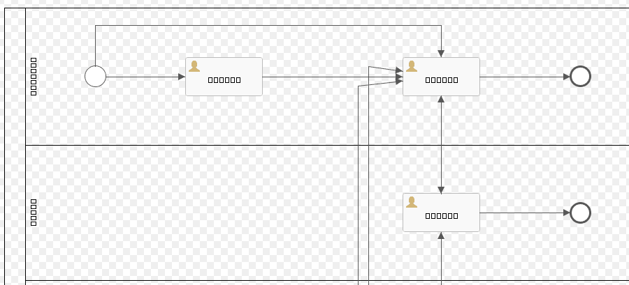
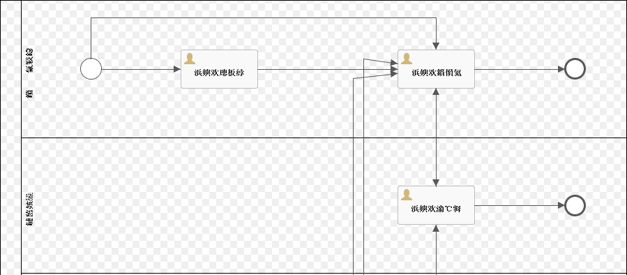

# Activiti 流程图片显示乱码问题分析与解决

Activiti新手常见的问题是，部署成功流程后，获取显示的流程图片（PNG）为乱码，主要体现为中文无法正确显示。在这里分析一下乱码出现的原因，以及解决方案。


## 表现

Activiti流程图乱码常见有两种情况：

1. 所有中文字符变成方块



1. 所有中文字符变成无意义汉字


造成这两种情况的错误原因以及解决方法并不相同，但都与Activiti部署、生成流程图的方法有关。下面先介绍Activiti的流程图生成方式。

## 背景介绍

Activiti中，使用的流程定义一般都是符合BPMN2.0标准的xml文本文件，后缀可以是.bpmn20.xml，.xml。其中包含了流程的全部定义内容，包括各节点、节点关联关系，以及用于定义显示的DI元素。

在部署流程定义时，Activiti引擎会判断，是否同时提供了流程图文件？如果一起提供了流程图文件，Activiti就省事了，直接使用这个文件作为流程图。

一般来说我们都不会先制作好流程图文件再部署，也就是说，部署时只有一个xml文件。这时候Activiti就需要自己生成对应的流程图文件了。

流程图文件会保存在Activiti的数据库ACT_GE_BYTEARRAY表中，作为BLOB保存。每个流程对应一个流程图文件。**所以流程图在部署时就已经确定，除非重新部署或手动处理，否则不管配置怎么修改，显示的都是最初的流程图。**

Activiti用于生成流程图的工具类是
```java
org.activiti.image.impl.DefaultProcessDiagramGenerator
```

这个类不止可以生成流程图，还可以生成流程运行状态图。具体可以参阅其中各方法的注释。

## 出错原因分析
### 中文字符变成方块

在部署流程时，生成流程图的代码位于
```java
// org.activiti.engine.impl.bpmn.deployer.BpmnDeployer.deploy():154 (Activiti 5.22中)

byte[] diagramBytes = IoUtil.readInputStream(processEngineConfiguration.
                    getProcessDiagramGenerator().generateDiagram(bpmnParse.getBpmnModel(), "png", processEngineConfiguration.getActivityFontName(),
                        processEngineConfiguration.getLabelFontName(),processEngineConfiguration.getAnnotationFontName(), processEngineConfiguration.getClassLoader()), null);
```

可见在这里，需要在processEngineConfiguration里，保存有正确的LabelFontName，以及AnnotationFontName作为参数，Generator才能正确生成（非英文）的流程图片。

### 中文字符变成无意义汉字

出现这种问题，基本上都是在Activiti提供的demo程序——Explorer中设计、部署流程的时候出现的。原因是demo程序有bug。

Activiti Explorer中提供的Activiti Modeler，是一个Web流程设计器。用于编辑、保存流程模型。这里请注意，不能用于新建，它生成的也只是流程模型，不是流程定义。生成的流程模型是Json格式的，也保存在ACT_GE_BYTEARRAY表中。

然后在Activiti Explorer中提供了“部署”的操作。对应的代码为(Activiti 5.22中)(实际有两个部署方式，不过画线部署的是这个。另一个是填表单方式部署，问题类似)
```java
// org.activiti.editor.ui.EditorProcessDefinitionDetailPanel.deployModelerModel()

protected void deployModelerModel(final ObjectNode modelNode) {
    BpmnModel model = new BpmnJsonConverter().convertToBpmnModel(modelNode);
    byte[] bpmnBytes = new BpmnXMLConverter().convertToXML(model);
    
    String processName = modelData.getName() + ".bpmn20.xml";
    Deployment deployment = repositoryService.createDeployment()
            .name(modelData.getName())
            .addString(processName, new String(bpmnBytes))
            .deploy();
    
    ExplorerApp.get().getViewManager().showDeploymentPage(deployment.getId());
}
```
大意是，将Modeler的数据格式(Json modelNode),转换为Activiti内部交换格式(BpmnModel model)，再转成xmlbyte(byte[] bpmnBytes)，然后在部署的时候再作为String加入部署
`.addString(processName, new String(bpmnBytes))`

很绕是不是？Activiti的开发者也把自己绕晕了，导致这里出现了bug。

```java
public byte[] convertToXML(BpmnModel model) {
  return convertToXML(model, DEFAULT_ENCODING);
}
```
转换为xmlbyte的方法里，指定了编码方式(为UTF-8)。但是再转回字符串的时候，却没有指定编码方式！ 
`new String(bpmnBytes)`

在未指定编码方式的时候，new String使用jvm定义的默认编码方式解析，而我们一般使用的都是gb2312，因此导致问题。


## 解决方法

**修改之后，需要重新部署或手动生成流程图片，才能看到效果！**

### 中文字符变成方块
在Activiti的配置中，加上字体配置即可。

对于Spring用户，在Spring配置文件中找到Activiti流程引擎定义的地方
```xml
<bean id="processEngineConfiguration" class="org.activiti.spring.SpringProcessEngineConfiguration">
    <property name="dataSource" ref="dataSource"/>
    <property name="transactionManager" ref="transactionManager"/>
    <property name="databaseSchemaUpdate" value="true"/>
    ...
```
在其中加上几个参数（按照Activiti的版本不同，参数数量不一定。用IDE提示，把所有带有font的都设置上就好了）。字体可以按照喜好设置，但需要保证tomcat运行时可以找到（例如默认安装的linux服务器很可能就没有）。
```xml
<property name="activityFontName" value="宋体"/>
<property name="labelFontName" value="宋体"/>
<property name="annotationFontName" value="宋体"/>

```
重启tomcat使配置生效，重新部署流程以重新生成流程图。方块字就ok啦。


### 中文字符变成无意义汉字

由于问题出在编码方式上，因此有几种修改方式
####1. 修改jvm默认参数。

在tomcat的vm运行参数上，加上-Dfile.encoding=UTF-8。不过副作用是导致整个项目都运行在utf-8下，对于写的不严谨的项目，可能导致其它地方默认使用gb2312编码的代码出错。

####2. 修改Explorer部署部分的代码
将`org.activiti.editor.ui.EditorProcessDefinitionDetailPanel.deployModelerModel():348`
修改为`.addString(processName, new String(bpmnBytes, "UTF-8"))`即可。

- 可以直接修改activiti的源码，编译后使用。

- 也可以在自己的项目下，手动创建`org.activiti.editor.ui.EditorProcessDefinitionDetailPanel`类，把Activiti的源码贴进去，再修改正确。这样我们重写的类就会由classloader优先加载，覆盖Activiti自己的实现，达到修改的目的。

####3. 说到底Explorer只是Activiti提供的demo样例。可以参考Explorer的代码，但直接拿来用并不明智。

### 显示字符为空白

这个严格来说并不是“乱码”，解决方法也很简单：画流程图的时候，少写几个字，或者把框框拖动搞大一点就可以了~
